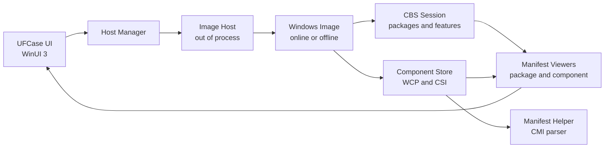

# UFCase - Windows Servicing Explorer

> [!IMPORTANT]
> UFCase is experimental software that works with low-level Windows servicing APIs and runs with elevated privileges. Do not use it on production systems, especially for package or feature mutation operations.

UFCase (Utility Functions Case) is a WinUI 3 desktop tool for inspecting and managing Windows servicing state. It helps Windows power users and servicing researchers explore online and offline Windows images through the same concepts used by CBS, DISM, WinSxS, package manifests, component manifests, and optional features.

Microsoft's [Understanding Component-Based Servicing](https://techcommunity.microsoft.com/t5/ask-the-performance-team/understanding-component-based-servicing/ba-p/373012) is a good public starting point. UFCase goes further into the undocumented layers that connect Windows Update metadata, registry-backed servicing state, WinSxS components, and native servicing APIs.

## What UFCase Manages

- Inspect the current online Windows image, mounted WIM images, and offline Windows installations found on local drives.
- Browse CBS packages, optional features, and WinSxS components.
- View package manifests (`.mum`) and component manifests.
- Follow manifest references from packages to packages/components and from component dependencies to components.
- Inspect component files, component identity, status, payload path, registry entries, and manifest dependencies.
- Perform experimental servicing state changes, including feature enable/disable and package install/remove/stage operations.

## Servicing Stack Concepts

The Windows servicing stack is not just Windows Update. Updates arrive as MSU/CAB payloads, CBS models them as packages and updates, WinSxS stores versioned components, and registry hives record servicing state. Package and component manifests are two important places where these relationships become inspectable.

UFCase documents these concepts because much of the useful detail is undocumented or only visible through internal interfaces. Read [Servicing Stack Concepts](./docs/servicing_stack_concepts.md) first for the power-user level overview, then continue to [Manifest Schema Notes](./docs/manifest_schema.md) for the lower-level XML/schema research.

## Architecture

UFCase keeps the UI and servicing work separated. The WinUI process owns navigation and view models; per-image host processes load CBS/WCP/CSI APIs and expose image, package, feature, component, and manifest data back to the UI through WinRT/COM interfaces.

## Project Organization

- `UFCase`: the WinUI 3 frontend, navigation, view models, image selector, package/component/feature pages, and manifest viewer windows.
- `UFCase.Host`: the out-of-process C++/WinRT servicing host for one Windows image.
- `UFCase.Interface`: the shared WinRT interface contract used across the UI, host, and proxy/stub.
- `UFCase.ProxyStub`: COM proxy/stub support for cross-process WinRT interfaces.
- `UFCase.Host.Manifest`: a C# WinRT component that wraps the native CMI serializer for cooked component manifests.
- `docs`: servicing concept notes, manifest schema research, and collected manifest samples.

## Design Notes

### Host Isolation

The servicing stack is process-global and version-sensitive. UFCase therefore runs privileged servicing work in separate host processes instead of loading every servicing stack into the UI process.

This design gives UFCase independent image lifetime control, cross-thread-friendly out-of-process COM calls, and a path toward future caching or service layers. It also makes offline image inspection more realistic because the host can load servicing binaries from the target Windows image rather than assuming the running OS is the only servicing stack in play.

### Packaged vs. Unpackaged

UFCase is currently configured as an unpackaged desktop app (`WindowsPackageType=None`, `AppxPackage=false`). Full-trust packaged apps isolate local COM registration, which makes packaged UI processes difficult to combine with elevated out-of-process hosts. Keeping both sides unpackaged avoids that PackagedCOM visibility problem for now.

### Manifest Viewing

UFCase currently focuses on package and component manifests. Package manifests and component manifests are different formats, although they share some assembly identity and XML namespace conventions. Package manifests describe package-level metadata, parents, and update entries. Component manifests describe component-level payload such as files, registry data, dependencies, and registration metadata.

Manifest viewing is not just raw XML display: UFCase uses these manifests to expose references that users can navigate through, and the same research feeds the schema documentation under `docs`.

## Runtime Dependencies

Core runtime requirements:

- Windows 10 1809 or later.
- Windows App Runtime / Windows App SDK runtime compatible with the project package references.
- Microsoft Visual C++ runtime for host binaries when using non-static debug or development builds.

Optional runtime requirement:

- .NET 6 Desktop Runtime. `UFCase.Host.Manifest` targets `net6.0-windows10.0.26100.0`; without the runtime, component manifest parsing/viewing can fail.

## Building

Open `UFCase.sln` in Visual Studio and restore NuGet packages.

Useful build details:

- The project uses C++20, C++/WinRT, WinUI 3, WIL, WebView2, and Windows App SDK 1.8 package references.
- The main app currently defines x64 and ARM64 configurations.
- `build/BuildAllHosts.targets` can build and copy host, proxy/stub, and C# WinRT outputs for requested host architectures when `BuildAllArchitectures=true`.
- `scripts/InTemplate.targets` renders `app.manifest.in` so generated manifests can include architecture-specific proxy/stub registration.

## Roadmap

### Current

- Online, mounted, and offline image inspection.
- Package, optional feature, and component browsing.
- Package and component manifest viewers.
- Initial manifest-driven navigation between packages and components.
- Out-of-process servicing hosts as the foundation for safer image lifetime and API isolation.

### Near Term

- Search and filtering for Packages and Components pages.
- Direct component reference query input.
- Cross-reference views for files, registry entries, components, and packages.
- Safer mutation UX with clearer confirmations, source handling, progress, errors, and rollback guidance.
- Better list batching and navigation selection behavior for large component stores.

### Long Term

- Runtime or persistent indexing for faster lookup.
- A cache/service layer between UI and isolated hosts.
- Broader package/component manifest schema coverage.
- Better MSIX/packaged deployment story if elevated COM visibility constraints can be solved cleanly.
- Memory and performance improvements for very large component stores.

## Known Limitations

- Mutation operations are experimental and should be tested only on disposable images.
- Online component payload paths can fail on some Windows builds. Offline images are currently the most reliable workaround.
- `Optionals` is present in navigation but is not implemented as a separate page yet.
- The host process model assumes matching unpackaged COM visibility between the UI and host.

## Releases

Breaking changes are published through [GitHub releases](https://github.com/seven-mile/UFCase/releases). CI builds may also publish `UFCase_portable.zip` artifacts from [GitHub Actions](https://github.com/seven-mile/UFCase/actions).

## Screenshots

